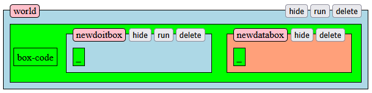

# Boxer-HTML - user documentation

## Running Boxer-HTML

To run the software, the user needs need to have a modern web browser and a `http` server installed on the user's system. During implementation, we used https://simplewebserver.org/download.html as a local http server solution. Once Simple Web Server is installed, click the "new server" button and pass the Boxer-HTML root directory to the path field. Then click "create server".
Alternatively, the user can use any other http server solution they prefer, as long as the project root directory is correctly targeted.
Once the preffered http server has been set up, Boxer-HTML is available in the `src` directory. 

## Using Boxer-HTML

Boxer-HTML is a web application, which can be accessed by a web browser. Upon launching Boxer-HTML, the user sees a empty `world` box and a canvas.

This world box contains a header bar with its name, and three control buttons. These buttons allow the user to execute boxes, minimize contents of a box, and delete it from the program. There is also a smaller, green box - this is where the code of a box resides. Here, the user can create operations or new, nested boxes.

### Expanding the Program

To start writing new code, click into the green box code section inside `world` and begin typing operations. The user can also use one of the prepared shortcuts to expand the program with new boxes. Keep in mind that currently, holding the backspace can irreversibly destroy parts of a nested box. This can be reversed using the `Ctrl+Z` shortcut.

#### Templates

To insert new boxes into a Boxer-HTML program, click into the green section of a box and use one of the initial box templates:

- `[` for inserting standalone box-code
- `]` for inserting a doit-box
- `{` for inserting a data-box

##### Data-box

Data-boxes are Boxer's variation of a variable, with the box contents serving as the value. This value can be anything from a simple text to a complex structure of nested boxes. To access these nested boxes inside a data-box, the user can use the dot syntax: `databox.nesteddatabox` to retrieve a variable, or `databox.nesteddoitbox` to call a nested doit-box.

##### Doit-box

In contrast to the data-box, a doit-box serves as a way to define a block of executable code. It is available to be executed using the header `run` button. The contents of a doit-box are also inacessible from the outside.

##### Box-code

The standalone box-code serves as a way to create a variation of doit-box which, instead of being called directly, is instead automatically executed as part of a parent box. All boxes defined within are also inacessinble from the outside.

##### Custom Templates

In addition to the three default templates, the user has the ability to create their own templates. The creation process involves creating a data-box, with its contents serving as the contents of the template. This data-box then has to be named following the `key_X_template` format, with `X` being a single character. To remove a custom template, the user only needs to change the name again, to one which does not follow the format.
In the image below, we can see an example of a template being used. by clicking into `BoxBefore` a typing `8`, the template contents are copied in. The result can be seen in `BoxAfter`.

#### Operations

There are currently 10 operations available. They can be separated into multiple categories based on their function.

##### Canvas Operations

There are 4 operations that serve as a way to draw shapes on the canvas. they are `forward`, `skip`, `left` and `right`. Forward draws a line in the current direction (default is directly down), while skip moves forward without drawing. Left and right then serve to rotate the direction of drawing.

##### Control Flow Operations

Operations `repeat`, `for` and `if` are used to modify the flow of code execution. the `repeat` operations executes the provided box code n times, while `for` iterates over a nested boxes of a provided box and passes the current iteration into the provided box code.
The `if` operation only executes the provided box if the condition is true.

##### Box calls

Within a box, the user has the ability to call another box within the program. This is done by simply typing the box name as a operation. Additionaly, the user can pass `arguments` into this called box. The called box can then receive them using the `input` operation.

##### Input

When calling another box, the user can potentially pass arguments to it. These arguments are caught using the `input` operation. 

##### Change

The change primitive is a unique operation in that it is the only one that can modify the program. It takes a box within the program, and replaces its box-code contents with another box contents.

##### Log

Log is by far the simples primitive operation, and serves as a way to write its argument into the JavaScript Console.

### Running the Program

To execute a box within Boxer-HTML, the user clicks on the relevant header `run` button. The execution then begins from this box, and its code is then executed in the order in which the operations were written. During the execution, the box may call other boxes, and may pass arguments into them. This allows using the combination of smaller boxes and primitive operations to form complex programs.

#### Scope

When trying to access another box, only boxes defined as nested within the initially run box, any boxes called within it (for the duration of their execution), and the parent boxes of the initially run box. 
The order of selection is as follows: first, the nested-most box currently being executed, then its caller, its caller and so on, until reaching the originally executed box. Then, the process continues by rising into the scope of its parent boxes and check their immediate child boxes, stopping upon the global scope. During this process, the first encountered box with the matching name is chosen.
This means that boxes in the smallest available scope take priority over those in larger scopes.

## Example Programs

During our evaluation of Boxer-HTML, we have recreated two examples of a boxer program. The "drawing" example showcases the combination of drawing and control flow operations to draw a complicated shape on the canvas. The "complex variable" example demonstrates working with a complex structure of data-boxes, as well as the `if` and `change` operations.
The re-created examples are also available in the `examples` directory.

